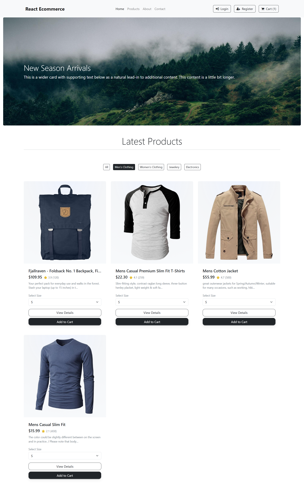
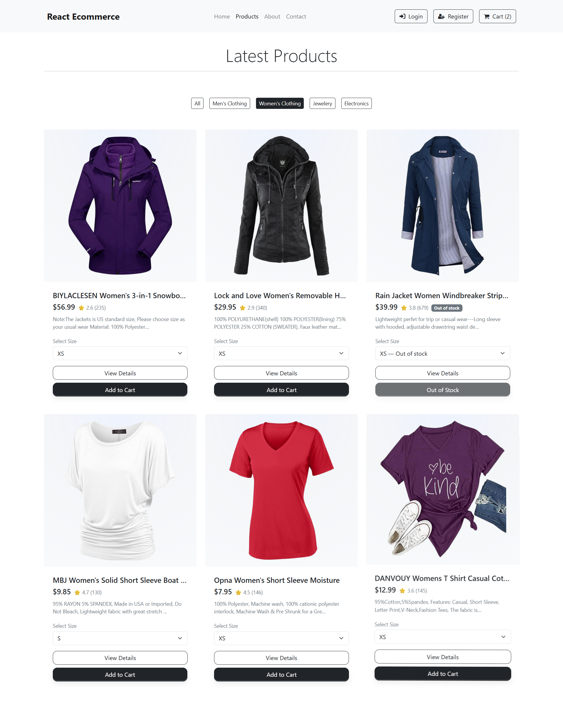
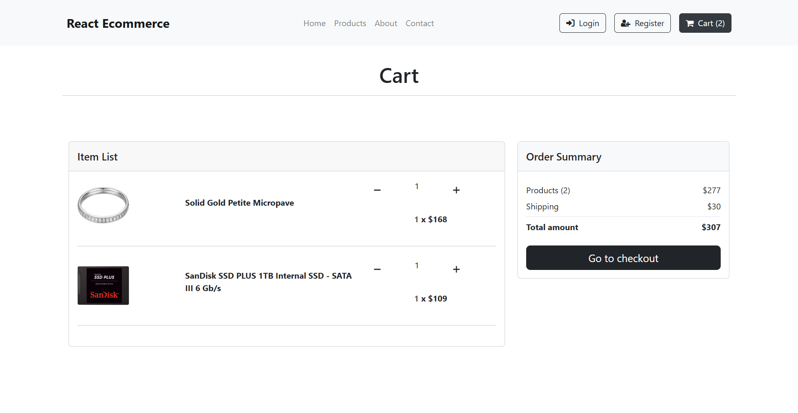
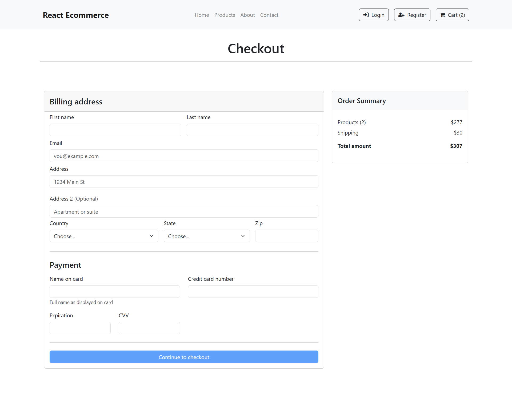

# Product Card Redesign Project

## Live Demo

You can access the project online at: [https://productcard-design.netlify.app/](https://productcard-design.netlify.app/)

## Project Screenshots

Below are some key screens and features of the project:

### Homepage
The homepage displays featured products and categories in a clean, modern layout.


### Product Categories for Electronics
Electronics category page showing a variety of products.


### Product Categories for Jewellery
Jewellery category page with product cards and filters.


### Product Categories for Men's Wear
Men's Wear category page with product listings.


### Product Categories for Women's Wear
Women's Wear category page with product listings.


### Cart Page
Cart page where users can review and update their selected products.


### Checkout Page
Checkout page for completing the purchase process.


### About Page
About page with project and team information.


## Layout Approach

The Product Card uses a card-based layout with a flexbox or grid container to organize the product image, name, price, variant options, and action button. The design features padding, subtle shadows, and rounded corners to create a clean and modern appearance that follows UI/UX best practices.

## Responsiveness Considerations

The card is designed to be fully responsive. Its width adapts to different screen sizes using flexible units (percentages or max-width). Media queries adjust font sizes, image scaling, and layout direction, ensuring the card remains user-friendly and visually appealing on both desktop and mobile devices.

## Run Locally

Clone the project

```bash
  git clone https://github.com/safdarhussainmangnejo/product-design.git
```

Go to the project directory

```bash
  cd product-design
```

Install dependencies

```bash
  npm install

```

Start the server

```bash
  npm start
```

The server should now be running. You can access the application by opening a web browser and entering the following URL:

```bash
  http://localhost:3000
```
